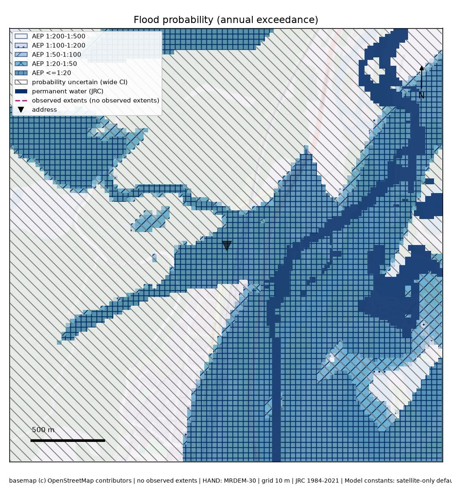
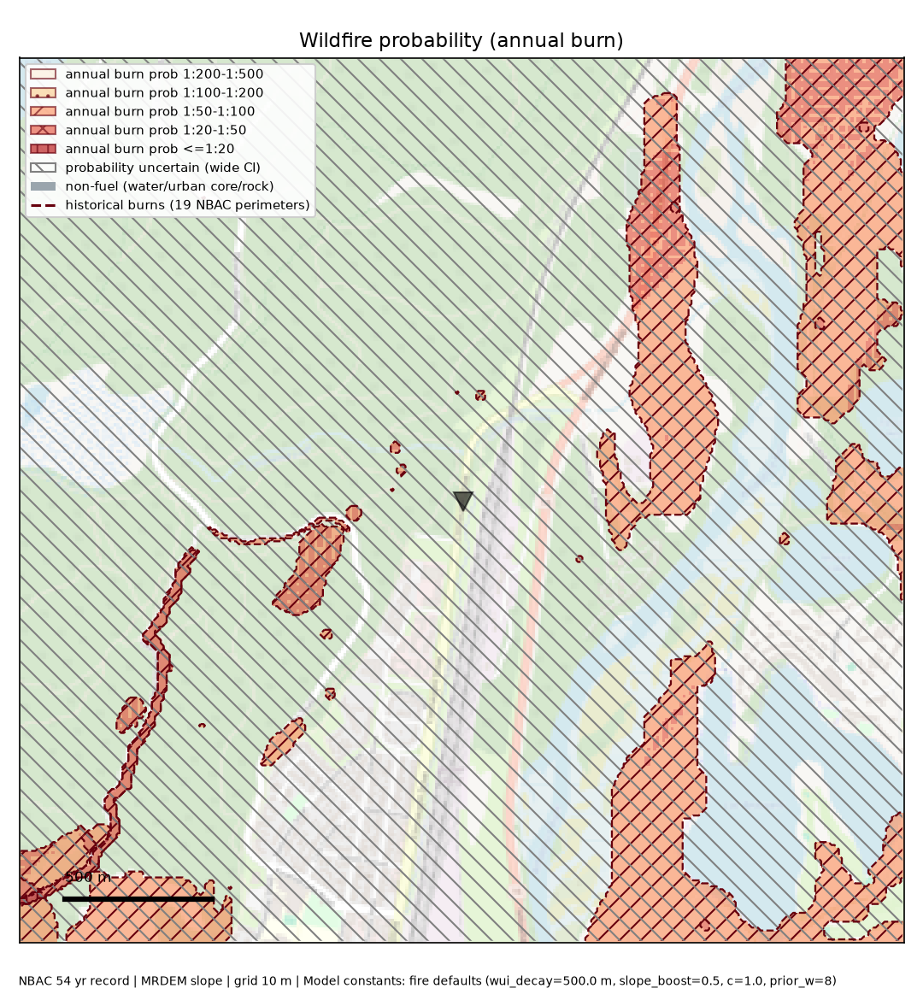

# HazardWise

**Property-level flood and wildfire risk assessment for Canada.**

HazardWise is a property risk assessment system for flood and wildfire hazards in Canada. It combines hydrometric records (HYDAT), terrain analysis (HAND on 30 m national elevation data), and wildfire burn history (NBAC) into a single pipeline, producing per-property risk reports for both hazards together. Flood risk is estimated using a statistical core built on extreme value methods (GEV and Log-Pearson III), with a confidence grading system (A through D) that reflects how much data is actually available for a given location.

The system is built around two principles:

- **Every number traces back to an evidence chain the user can inspect.** A report never just states a probability; it shows the terrain, the historical record, and the calculation that produced it.
- **Uncertainty is reported honestly.** Every estimate carries a credible interval and a confidence grade rather than a single confident-looking score, and the grade is capped whenever the underlying evidence is thin (no gauge, short record, imprecise geocoding).

## What it does

- **Dual-hazard reports.** One address, one report, with independent evidence chains for flood and wildfire risk — neither hazard borrows the other's grade.
- **Works with or without a gauge.** Where a hydrometric station exists, HazardWise uses it. Where it doesn't, a satellite-only mode falls back to 38 years of optical water-occurrence data (JRC Global Surface Water) binned against terrain, so rural and ungauged properties still get an estimate instead of a refusal.
- **Wildfire risk from burn history.** Annual burn probability is modelled from 50+ years of mapped fire perimeters (NBAC), local fuel exposure, and terrain slope, reported at the "reach" level — the risk to the structure from fire within a couple hundred metres, not just the exact pixel.
- **Regional event history.** Reports list actual nearby fires and floods over 10/20/50-year windows, with counts, years, and distance to the nearest event.
- **Maps built for real use.** Risk bands use both colour and cross-hatching, so the maps stay legible in grayscale printing and for colourblind readers. Reports include both a close-in probability map and a wider regional context map (aerial or street basemap).
- **A confidence grade on everything.** Every estimate is graded A–D based on data quality (gauge vs. satellite-only, record length, geocoding precision), so a thin-evidence number is visibly flagged rather than presented with false confidence.
- **Local web UI.** A lightweight local server lets you type in an address and get a formatted report back, maps included.

## Example report

Below is an excerpt from a real dual-hazard report generated by HazardWise for a property on Connaught Drive in Jasper, AB.

**Flood risk: High — Grade C — 10.4% annual probability** (roughly once every 10 years; credible range 0.0%–25.0%)

> Satellite-only mode: no hydrometric gauge or HYDAT record was used. Terrain analysis (HAND) puts this address 1.3 m above the nearest mapped channel. 38 years of optical water observations were binned by terrain height to build an empirical wet-probability curve for this reach; evaluated at the address's elevation, that curve gives a central annual probability of 10.4%. No observed flood extents are available for this window yet, so the estimate rests on the occurrence history alone.

**Wildfire risk: High — Grade C — 2.0% annual probability** (roughly once every 49 years; credible range 0.1%–5.6%)

> No in-situ fire-weather station was used. 19 mapped burn perimeters over a 54-year regional record give a base burn rate for the area; combined with the property's fuel exposure and terrain slope, the reach-level annual burn probability comes to 2.04%. A fire in 2008 burned to within 224 metres of this address, and 6 fires have been mapped within 10 km in the past decade alone.

Every report ends with a full list of the underlying data sources (JRC Global Surface Water, NRCan terrain and burn-area datasets, CWFIS fire data, NASA FIRMS) so every number can be traced back to its origin.

## Data sources

- EC JRC / Google — Global Surface Water v1.4 (occurrence 1984–2021)
- NRCan — Emergency Geomatics Service flood extents (SAR-derived)
- NRCan — MRDEM 30 m Digital Terrain Model (CanElevation)
- NRCan/CWFIS — NBAC National Burned Area Composite (1972–present)
- NRCan/CWFIS — FBP fuel type grids & Fire Weather Index climatology
- NASA FIRMS — VIIRS/MODIS hotspot archive
- OpenStreetMap Nominatim (geocoding)

---

*This repository showcases HazardWise's methodology and output. The project is under active development; source code is not currently public.*
